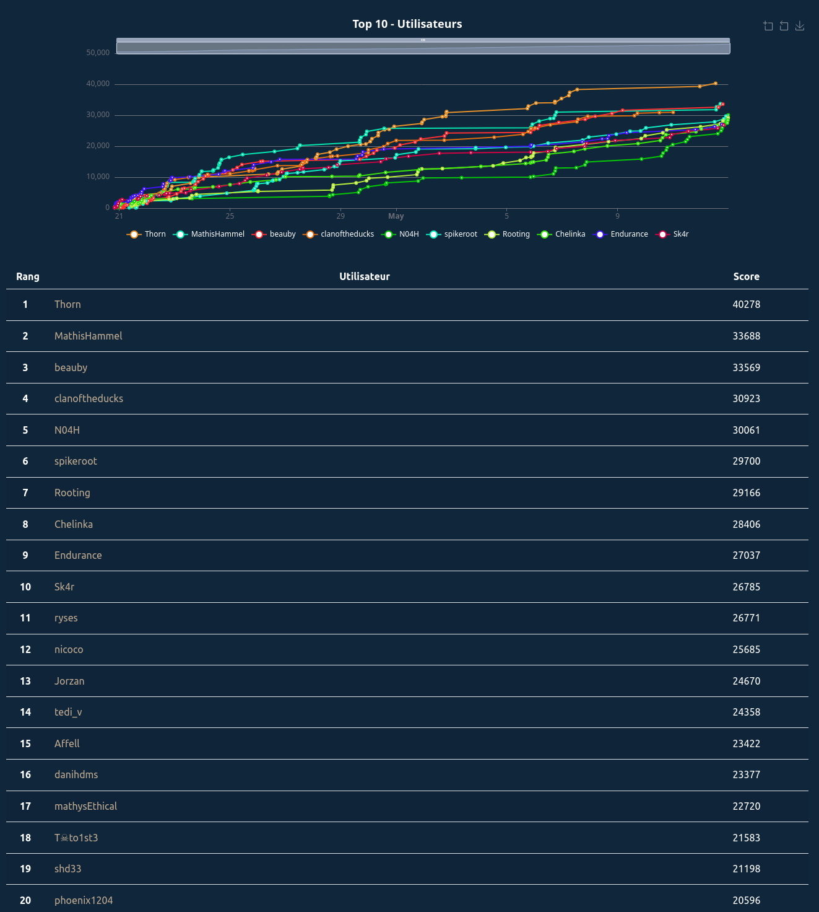

[404CTF 2023](https://ctf.404ctf.fr) is an online CTF event supported by the [DGSE](https://www.dgse.gouv.fr) (French foreign intelligence service). The challenges where made by students of [HackademINT](https://www.hackademint.org/). It was held from April 20, 2024 to May 12, 2024. During this CTF, I played under the name **_Endurance_** and scored **9th** on the global scoreboard.

The sources for the challenges are available [here](https://github.com/HackademINT/404CTF-2024).

## Scoreboard

## Challenges

| Solved | Name | Points | Tags | Description |
| ------ | ---- | ------ | ---- | ----------- |
| :passed: | Bébé nageur | 100 | `Crypto` | |
| :passed: | Le petit bain | 200 | `Crypto` |  |
| :passed: 🩸 | Poor Random Number Generator [2/2] | 956 | `Crypto` | LFSR for random generation |
| :passed: 🩸 | Poor Random Number Generator [1/2] | 271 | `Crypto` | LFSR for random generation |
| :passed: | La Seine | 968 | `Crypto` | Encryption with repeated operations in an euclidean ring |
| :passed: 🩸 | Zack Adeaux | 967 | `Crypto` | Encrypted string with a simple backpack problem |
| :passed: | J'éponge donc j'essuie | 891 | `Crypto` | Sponge construction with small state |
| :passed: | Plongeon Rapide Super Artistique | 698 | `Crypto` |  |
| :failed: | SEA - La face cachée de l'Iceberg | 999 | `Crypto` |  |
| :failed: | RSAlade-tomatECC-oigNPon | 1000 | `Crypto` |  |
| :failed: | La Brasse ou Le Papillon ? | 1000 | `Crypto` |  |
| :passed: | Échauffement | 100 | `Reverse` | |
| :passed: | Intronisation du CHAUSSURE | 200 | `Reverse` | |
| :passed: | Revers(ibl)e Engineering [1/2] | 703 | `Reverse` | Time limited crackme made to be solved with automatic SSE |
| :passed: | Revers(ibl)e Engineering [2/2] | 972 | `Reverse` | Crackme that downloads code from a server. Made to be solved with automatic SSE |
| :passed: | Bugdroid Fight [1/2] | 200 | `Reverse` | Find strings spread across an android application |
| :passed: | Bugdroid Fight [2/2] | 776 | `Reverse` | Crackme on android |
| :passed: | Nanocombattants | 956 | `Reverse` | Crackme with sub-processes where input bytes can be bruteforced individually |
| :failed: | Poids Raw vs. Cours Jette [2/3] | 1000 | `Reverse` |  |
| :failed: | Le Tableau Noir | 1000 | `Reverse` |  |
| :failed: | L'entrée du Dojo | 1000 | `Reverse` |  |
| :passed: | Jean Pile | 820 | `Pwn` | simple ret2libc |
| :passed: | Pseudoverflow | 100 | `Pwn` |  |
| :passed: | Mordu du 100m | 905 | `Pwn` | One byte overflow to call a win function |
| :failed: | Antismash | 993 | `Pwn` |  |
| :passed: | Vous êtes en RETARD | 100 | `Web` |  |
| :passed: | Le match du siècle [1/2] | 100 | `Web` | Temper cookies |
| :passed: | Le match du siècle [2/2] | 200 | `Web` | Temper cookies |
| :passed: | Exploit mag | 200 | `Web` | Bypass paywall using GoogleBot user-agent |
| :failed: | LE GORFOU 42 | 614 | `Web` | |
| :failed: | La Boutique Officielle | 998 | `Web` | |
| :passed: | Le tir aux logs | 100 | `Forensics` |  |
| :passed: | Darts Bank | 200 | `Forensics` |  |
| :passed: | Un boulevard pour pointer | 100 | `Forensics` | XFS filesystem with a deleted file |
| :passed: | Coup de circuit [1/3] | 200 | `Forensics` | Find the SHA1 of a malware in logs |
| :passed: | Vaut mieux sécuriser que guérir| 741 | `Forensics` | Memory dump with persistence using a Windows task |
| :failed: | De bons croissants au beurre | 987 | `Forensics` | |
| :failed: | Poids Raw vs. Cours Jette [1/3] | 988 | `Forensics` | |
| :failed: | Poids Raw vs. Cours Jette [3/3] | 1000 | `Forensics` | |
| :passed: | Serial killer | 100 | `Hardware` | |
| :passed: | Le soulevé de GND | 388 | `Hardware` | reverse a myHDL circuit |
| :passed: | Comment est votre modulation ? [1/2] | 842 | `Hardware` | Demodulate ASK signal |
| :passed: | Comment est votre modulation ? [2/2] | 942 | `Hardware` | Demodulate OFDM signal |
| :passed: | Sea side channel [1/4] - Introduction | 946 | `Hardware` | Introduction to isogeny-based cryptography |
| :failed: | Sea side channel [2/4] - Reconnaissance | 999 | `Hardware` | Side channel attack on an isogeny-based system implemented in rust |
| :failed: | Sea side channel [3/4] - Mais où sont les triggers ?  | 1000 | `Hardware` | |
| :failed: | Sea side channel [4/4] - Contre-mesures  | 1000 | `Hardware` | |
| :passed: | Bienvenue | 100 | `Misc` | Look for the flag in the rules | 
| :passed: | Discord | 10 | `Misc` | Look for the flag in a discord announcement |
| :passed: | De la friture sur la ligne | 100 | `Misc` |  |
| :passed: | Coup de circuit [3/3] | 940 | `Misc` | Find the sources of a website on GitHub |
| :passed: | Revers(ibl)e Engineering [0/2] | 905 | `Misc` | Find the shortest equivalent gate circuit using CNOT and Toffoli gates |
| :passed: | L'absence | 100 | `Steg` | |
| :passed: 🩸 | La Barre Fixe | 992 | `Steg` | Steganography using x86 prefixes |
| :passed: | Le grand écart | 876 | `Steg` |  |
| :passed: | La chute | 940 | `Steg` | Monoalphabetic substitution cipher |
| :passed: | Du poison [1/2] | 100 | `AI` | Decrease the accuracy of a federated learning model |
| :passed: | Du poison [2/2] | 352 | `AI` | Decrease the accuracy of a federated learning model |
| :passed: | Du poison [3/2] | 956 | `AI` | Change the output of a classifier (based on regression) by modifying 2 weights of the regression model |
| :passed: | Des portes dérobées | 891 | `AI` | Add a backdoor to a federated learning model |
| :passed: | Des trains superposés | 100 | `Quantum` | |
| :passed: | De l'écoute, pas très discrète | 958 | `Quantum` | Man-in-the-middle attack on a quantum key exchange |
| :passed: | De l'inversion | 995 | `Quantum` | Reverse a circuit with quantum gates |
| :passed: | De la multiplicité des problèmes | 975 | `Quantum` | Prepare a state with a quantum circuit |
| :passed: | Légende | 100 | `OSINT` | Find information from a picture |
| :passed: | Not on my watch | 200 | `OSINT` | Find the number of issued watches from a specific model |
| :passed: | Coup de circuit [2/3] | 200 | `OSINT` | Find the subdomain of a website |
| :failed: | That Escalated Quickly | 831 | `OSINT` | Find the name of a mountain climber from parts of an image |
| :failed: | Secret training [1/2] | 772 | `OSINT` | Find a person's name from a username |
| :failed: | Secret training [2/2] | 965 | `OSINT` |  |

