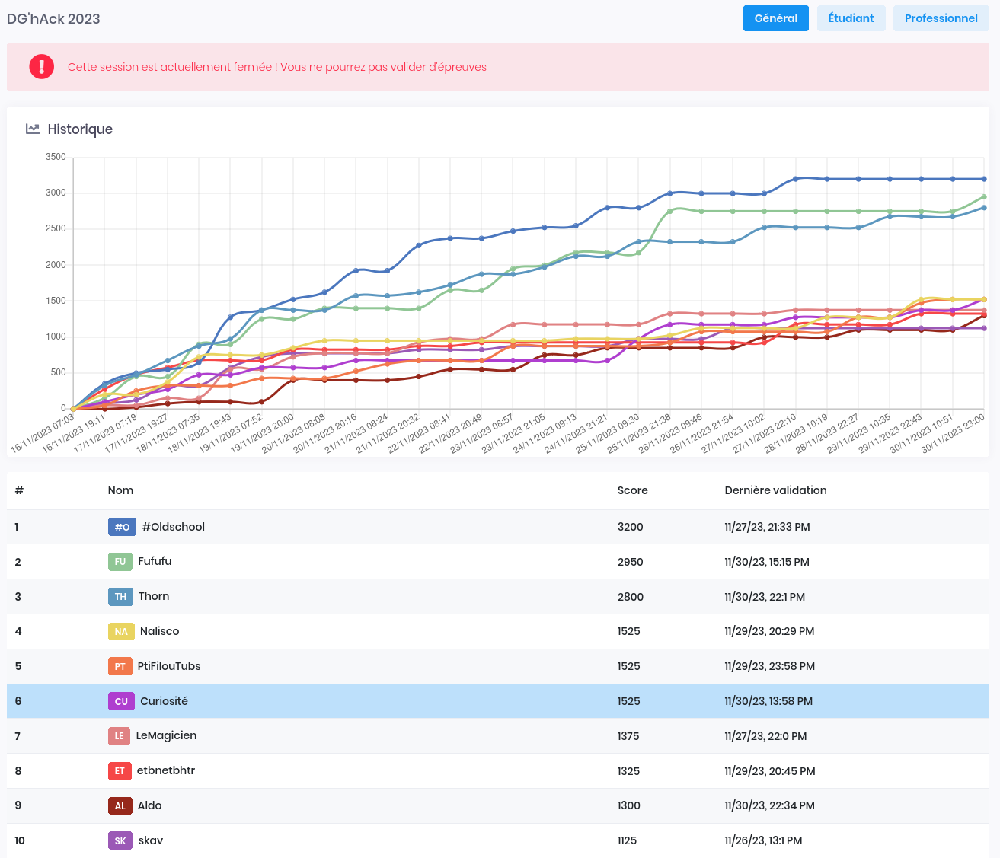
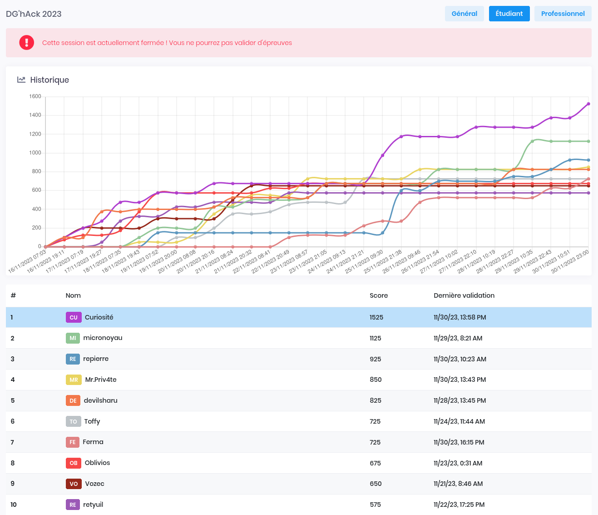

[DG'hAck 2023](dghack.fr) is a CTF event held by the DGA (branch of the French military). There were 24 challenges this year but I was only able to fully solve 11 of them. Yet I was able to reach **global rank 6** and first on the student's leaderboard under the name **_Curiosité_**.

## Scoreboard

| Global scoreboard | Student scoreboard |
| ----------------- | ------------------ |
|  |  |

## Challenges

| Solved | Name | Points | Tags | Description |
| ------ | ---- | ------ | ---- | ----------- |
| :passed: | [Feed This Dragon](#feed-this-dragon) | 50 | Dev | Interact with a game through an API |
| :passed: | [CryptoNeat](#cryptoneat) | 50 | Web Crypto | AES CTR Nonce reuse |
| :passed: | [TicToc](#tictoc) | 100 | Dev | Side channel attack on the time to verify admin's password |
| :passed: | [Wrongsomewhere](#wrongsomewhere) | 50 | Reverse | Ransomware that uses a machine specific Windows registry key to derive an encryption key |
| :passed: | [Infinite Money Glitch](#infinite-money-glitch) | 200 | Dev | Read codes on videos with OCR |
| :passed: | [Plugin again](#plugin-again) | 100 | Web | Bypass Content Security Policy (CSP) thanks to a permissive rule on a CDN that allows github repos |
| :failed: | [Remove Before Flight](#remove-before-flight) | 100 | Web |  |
| :failed: | [Awesome Doc Converter](#awesome-doc-converter) | 150 | Web |  |
| :passed: | [AEgisSecureForge](#aegissecureforge) | 200 | Crypto | Read PrivateBin data in network traffic and ECB encryption oracle |
| :failed: | [PoliceForensic](#policeforensic) | 150 | Forensics |  |
| :failed: | [KeepQuiet](#keepquiet) | 100 | Reverse |  |
| :failed: | [Damn Deprecation](#damn-deprecation) | 300 | Forensics Reverse | Compromised linux kernel injected through dependency injection |
| :passed: | [L'an 1, et puis l'an 2](#lan-1-et-puis-lan-2) | 150 | Forensics | Decipher EmpireC2 communications with a Windows machine KeyStore private key found in a memory dump |
| :failed: | [Catch Him If You Can](#catch-him-if-you-can) | 100 | Detection |  |
| :failed: | [My Virtual Bookstore](#my-virtual-bookstore) | 200 | Exploitation |  |
| :passed: | [A Maze In](#a-maze-in) | 50 | Steganography | Maze solving on a sticker |
| :failed: | [Time To Fight Back](#time-to-fight-back) | 150 | Exploitation |  |
| :failed: | [Save the earth or loose yourself?!](#save-the-earth-or-loose-yourself) | 100 | Exploitation OSINT |  |
| :failed: | [Randigma (ESN'HACK)](#randigma-esnhack) | 150 | Crypto |  |
| :failed: | [JarJarBank](#jarjarbank) | 300 | Web | Vulnerable SOAP service |
| :passed: | [Android Mirrors](#android-mirrors) | 150 | Dev Reverse | Dynamic java method calls that simulate the path of a laser in mirrors. The key of the crackme was the mirrors orientations |
| :failed: | [Pixle](#pixle) | 200 | Reverse |  |
| :partial: | [A_Maritime_Journey](#a_maritime_journey) | 150 | Forensics | Questions on the NMEA 0183 protocol |
| :passed: | [TicTacPwn](#tictacpwn-créé-par-w00dy-esnhack) | 300 | Exploit | From file read and arbitrary memory writes with all protections to RCE by writing a ROP chain on the stack |
