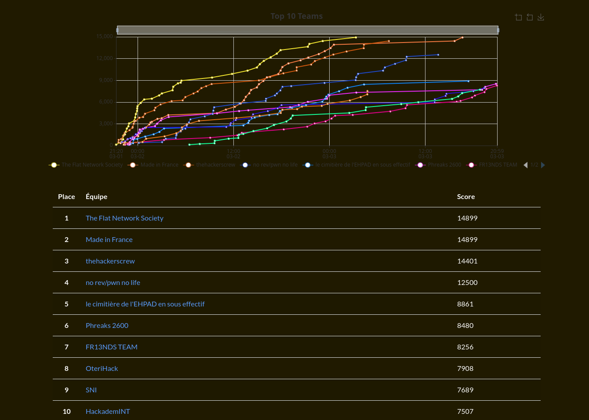

[GCC CTF 2024](https://gcc-ctf.fr) is an online CTF organized by [GCC](https://twitter.com/gcc_ensibs) (Galettes, Cidre, CTF), a CTF club from the [ENSIBS](www-ensibs.univ-ubs.fr) school. The CTF is open to everyone and is held from the 1st to the 3rd of March 2024. I played with the *S'hydrat* team under the name **_Sérendipité_**.

The challenges and some writeups are available at the official [GCC CTF 2024 repository](https://github.com/GCC-ENSIBS/GCC-CTF-2024).

## Scoreboard

| Scoreboard |
| ---------- |
||

## Challenges

#### Crypto

| Solved | Name | Points | Tags | Description |
| ------ | ---- | ------ | ---- | ----------- |
| :passed: | GCC News | 100 | `Crypto` |  |
| :passed: | [SuperAES](./SuperAES) | 404 | `Crypto` |  |
| :failed: | Elliptic | 471 | `Crypto` |  |
| :passed: | Too Many Leaks | 397 | `Crypto` |  |
| :failed: | Trust Issues | 500 | `Crypto` |  |

#### Forensic

| Solved | Name | Points | Tags | Description |
| ------ | ---- | ------ | ---- | ----------- |
| :passed: | BipBipBiiip | 100 | `Forensic` |  |
| :passed: | Pretty Links | 348 | `Forensic` |  |
| :failed: | Fill the library | 458 | `Forensic` |  |
| :failed: | Threat analysis | 467 | `Forensic` |  |

#### Misc

| Solved | Name | Points | Tags | Description |
| ------ | ---- | ------ | ---- | ----------- |
| :passed: | Legerdemain | 381 | `Misc` |  |
| :failed: | Bad Habit | 431 | `Misc` |  |
| :passed: | Diabolical Grumpy Analyst | 431 | `Misc` |  |
| :failed: | GCC Online | 475 | `Misc` |  |
| :failed: | SoBusy | 436 | `Misc` |  |
| :passed: | Legerdemain Revenge | 404 | `Misc` |  |

#### OSINT

| Solved | Name | Points | Tags | Description |
| ------ | ---- | ------ | ---- | ----------- |
| :passed: | But they so tasty ... 😔🍰 | 267 | `OSINT` |  |
| :passed: | Music from the city | 267 | `OSINT` |  |
| :passed: | On the loose [1/2] | 453 | `OSINT` |  |
| :passed: | On the loose [2/2] | 490 | `OSINT` |  |

#### Pwn

| Solved | Name | Points | Tags | Description |
| ------ | ---- | ------ | ---- | ----------- |
| :failed: | Cuttin'String | 329 | `Pwn` |  |
| :failed: | Baby bof | 453 | `Pwn` |  |
| :failed: | Flag Roulette | 497 | `Pwn` |  |

#### Reverse

| Solved | Name | Points | Tags | Description |
| ------ | ---- | ------ | ---- | ----------- |
| :passed: | rAnSoM | 100 | `Reverse` |  |
| :passed: | GCC Chat 1/2 | 339 | `Reverse` |  |
| :passed: | GCC Chat 2/2 | 467 | `Reverse` |  |
| :passed: | Array programming rocks | 431 | `Reverse` |  |
| :failed: | Warp jump | 453 | `Reverse` |  |

#### Web

| Solved | Name | Points | Tags | Description |
| ------ | ---- | ------ | ---- | ----------- |
| :passed: | Find The Compass | 100 | `Web` |  |
| :failed: | frenzy flask | 100 | `Web` |  |
| :failed: | Free Cider | 299 | `Web` |  |
| :failed: | The Genie's pwn adventures | 381 | `Web` |  |
| :failed: | Free Chat | 490 | `Web` |  |
| :failed: | MLWeb | 481 | `Web` |  |
| :failed: | The Genie's pwn adventures revenge | 458 | `Web` |  |

#### Web3

| Solved | Name | Points | Tags | Description |
| ------ | ---- | ------ | ---- | ----------- |
| :passed: | Synthatsu katana thief | 299 | `Web` |  |
| :failed: | First drop | 458 | `Web` |  |
| :failed: | TOOTB | 492 | `Web` |  |
| :failed: | Pincer | 498 | `Web` |  |
| :failed: | Ode | 494 | `Web` |  |
